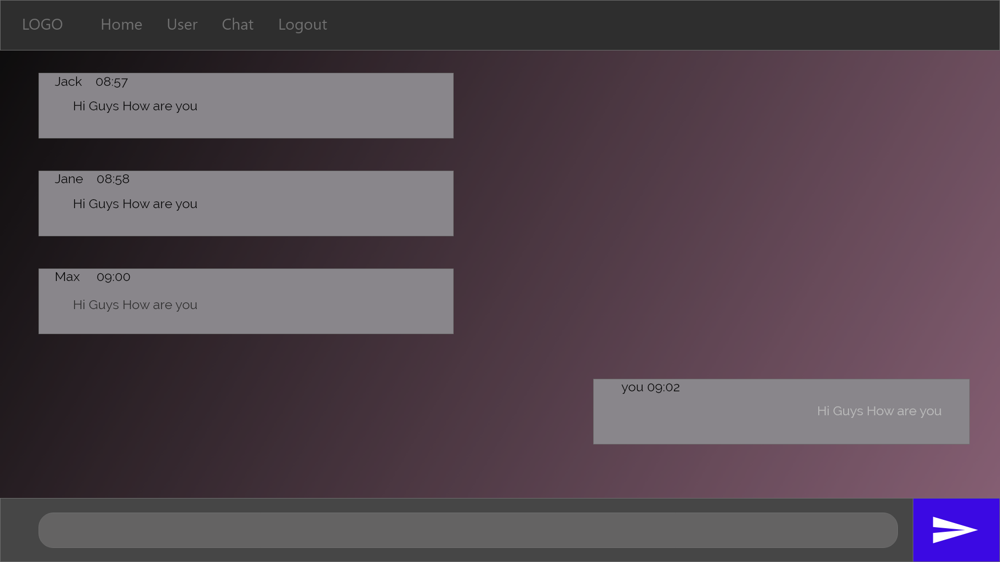
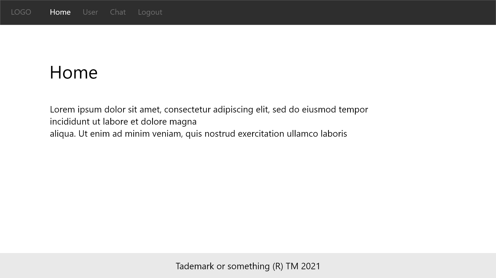
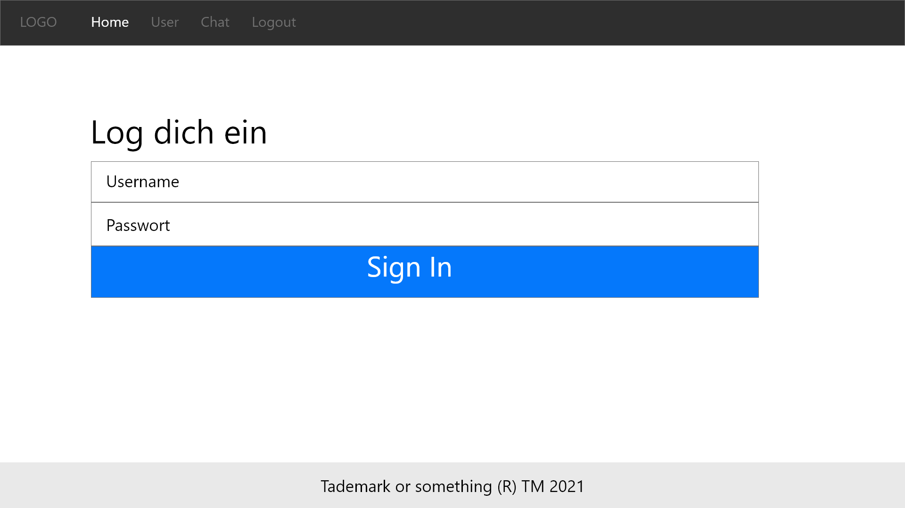
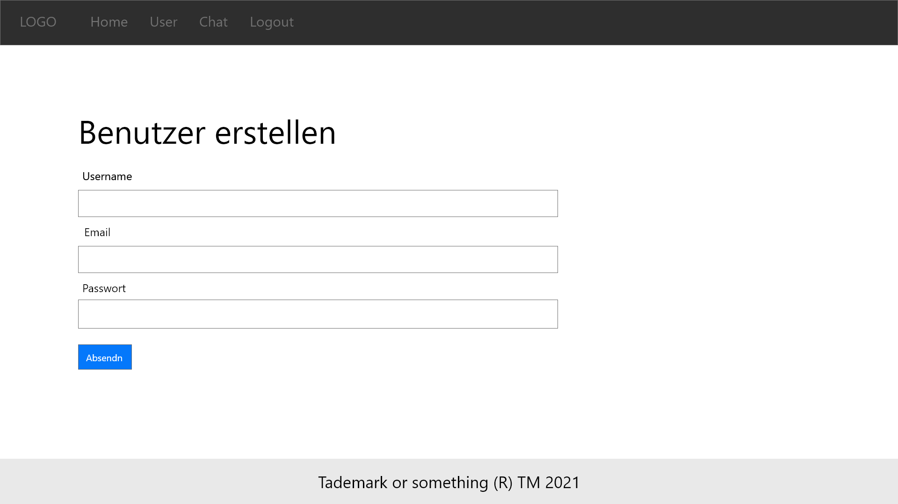
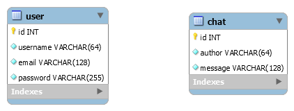
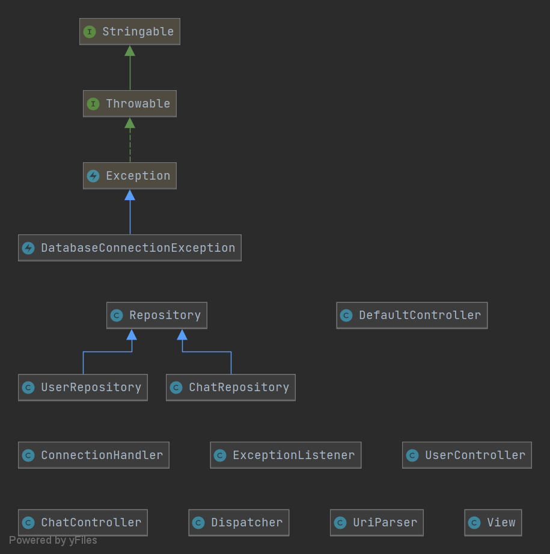

# TalkToMe

## Dokumentation Teil 1

## Version 1.0.0, 1. Dezember 2015 | Vorname Nachname des Autors

# Abstract

Unser Projekt hat Ähnlichkeiten mit der Applikation Discord. Unser Ziel ist es am Ende einen Chatroom zu haben in

welchem man sich über diverse Themen austauschen kann. Alles, was man dafür tun muss, ist ein Account zu erstellen sich

anzumelden und darauf loszuschreiben.

Chat wird unsere Tabelle sein, auf welcher das CRUD angewendet wird.

Die Schwierigkeiten werden wahrscheinlich der live Chat sein. Das alle online User wie auch diejenigen welche nicht

online sind denn Chatverlauf auch im Nachhinein sehen können.

# Anforderungsanalyse

## Zielgruppe

Zielgruppenanalyse

###Altersgruppe

Bei der Altersgruppe dachten wir an Leute zwischen 15 und 25

da diese Altersgruppe sehr aktiv im Internet ist.

###Sprachgruppe

Da die Webseite momentan auf Deutsch ist zielen wir auf eine deutsche Sprachgruppe.

###Region

Da die Webseite momentan auf Deutsch ist, ist unsere Zielregion die Schweiz, Deutschland, Österreich und Liechtenstein.

###Kompetenzen im Umgang mit Webseiten

Für die Seite braucht man wenig technische Kompetenz.

###Technische Ausrüstung

Ein gerät welches eine Webseite anzeigen kann.

# GUI Design

## Mockups

Dies war die erste Idee für den Chatroom.
Wegen den vielen Farben haben wir es umgeändert.
 

Dies war die zweite Idee für den Chatroom.
Diese Idee haben wir besser gefunden da es simpler und stylisher aussieht.
 

 

Diese Seiten haben wir von Bootstrap 

## Farbkonzept

Für den Hintergrund des Chats
haben wir einen Farbübergang von #101010 (sehr dunkelgrau fast schwarz) zu #f0a6ca(pink/Rose)..
 

Für den Hintergrund der Seite (Login, Home, Sign Up) haben wir Whitespace verwendet, sodass
der User eine bessere Übersicht hat.

 

Für die texte und Navigation bar haben wir ein sehr dunkles Grau genommen, weil wir einen
hohen Kontrast erschaffen wollten, sodass Benutzer mit Sehschwächen auch durch die Seite navigieren können..
 

Für die Buttons und links haben wir die Farbe Blau genommen da die Farbe Blau links
symbolisiert.

# Datenhaltung

## ERM

# Technische Dokumentation

## Code Style

Alle Seiten sind hauptsächlich mit Bootstrap gestylt. Ausser der Chatroom diesen haben wir selber mit CSS gestylt.

## Testprotokoll

| Projekt | TalkToMe |
| --- | --- |
| Testperson | Fabio |
| Datum, Zeit | 31.3.2021 |
| Eingesetzte Software | Google Chrome Version 89.0.4389.90 (Offizieller Build) (64-Bit), Windows |

| Abschnitt | Inhalt |
| --- | --- |
| Ziel | Ich kann einen User erstellen. |
| Erfüllt | Ja |
| Bemerkung |keine
|

| Abschnitt | Inhalt |
| --- | --- |
| Ziel | Ich kann einen User löschen. |
| Erfüllt | Ja |
| Bemerkung |keine
|
|

| Abschnitt | Inhalt |
| --- | --- |
| Ziel | Ich kann mich mit meinem erstellten User einloggen.|
| Erfüllt | Ja |
| Bemerkung |keine
|
|

Abschnitt | Inhalt |
| --- | --- |
| Ziel | Ich kann mich mit einem Benutzernamen und einem Passwort anmelden. |
| Erfüllt | Ja |
| Bemerkung |keine
|

| Abschnitt | Inhalt |
| --- | --- |
| Ziel | Ich kann einen Chatroom sehen. |
| Erfüllt | Ja |
| Bemerkung |keine
|

| Abschnitt | Inhalt |
| --- | --- |
| Ziel | Ich sehe welcher User was geschrieben hat.|
| Erfüllt | Ja |
| Bemerkung |keine
|

| Abschnitt | Inhalt |
| --- | --- |
| Ziel | Ich sehe denn Chatverlauf. |
| Erfüllt | Ja |
| Bemerkung |keine
|

| Abschnitt | Inhalt |
| --- | --- |
| Ziel | Als uneingeloggter User kann ich nicht auf den Chat zugreifen.|
| Erfüllt | Ja |
| Bemerkung |keine
|
|

| Abschnitt | Inhalt |
| --- | --- |
| Ziel | Ich kann die Nachrichten eines anderen Users lesen. |
| Erfüllt | Ja |
| Bemerkung |keine
|

| Abschnitt | Inhalt |
| --- | --- |
| Ziel | Ich kann eine Nachricht schreiben. |
| Erfüllt | Ja |
| Bemerkung |keine
|

| Abschnitt | Inhalt |
| --- | --- |
| Ziel | Ich kann eine Nachricht senden |
| Erfüllt | Ja |
| Bemerkung |keine
|

| Abschnitt | Inhalt |
| --- | --- |
| Ziel | Ich kann meine Nachricht löschen |
| Erfüllt | Ja |
| Bemerkung |keine
|

| Abschnitt | Inhalt |
| --- | --- |
| Ziel | Erfolgreiche sql injection |
| Erfüllt | nein |
| Bemerkung |seite ist gegen sql injections sicher

| Abschnitt | Inhalt |
| --- | --- |
| Ziel | Der User mit ID 2 ist von einem Hacker gelöscht worden |
| Erfüllt | nein |
| Bemerkung |id wird mit post weitetgegeben

| Abschnitt | Inhalt |
| --- | --- |
| Ziel | Erfolgreiches xss |
| Erfüllt | nein |
| Bemerkung |seite ist gegen xss geschützt

Unterschrift der Testperson: Fabio

## Installationsanleitung

### Systemanforderungen

Welche Systemanforderungen hat die Applikation.

- Apache httpd 2.4.46

- PHP 8.0.2 (cli) (built: Feb 3 2021 18:36:40) ( ZTS Visual C++ 2019 x64 ) 

  Zend Engine v4.0.2, 

  with Xdebug v3.0.3,  

- HTML5

- CSS 4

- Google Chrome Version 89.0.4389.90 (Offizieller Build) (64-Bit)

### Installation

Wie kann die Software Schritt für Schritt auf einem neuen System installiert werden?

- Xdebugger bei PHP.ini hinzufügen.

- Composer installieren.

- Eine DB mit dem Namen mvcdemo erstellen und darin das File schema.sql ausführen.

- im Host File.

  127.0.0.1    talktome.local hinzufügen.

# Benutzerhandbuch

##Menüführung

###Logo
Das Logo bringt einem auf die Startseite.
###Home
Home bringt einem auf die Startseite.
###Login
Bei Login kann man sich mit einem bereits existierenden User anmelden.
###Sign up
Bei Sign Up kann man einen User erstellen.
###User
User zeigt Informationen über den angemeldeten User an.
###Chat
Ein Chatroom auf dem man mit allen anderen schreiben kann.
###Logout
Wenn man eingeloggt ist kann man sich hier ausloggen.

##CRUD
Wie können die vier CRUD Funktionen auf dem CRUD Element ausgeführt werden?

C. Die Nachricht wird gesendet.

R. Die Nachricht wird angezeigt.

U. Die Nachricht wird bearbeitet.

D. Die Nachricht wird gelöscht.

# Fazit

###1. Was lief gut/schlecht? 

Am besten lief das Erstellen des Chats mit PHP, JS und SQL, da dies am meistens pass machte. 

Aber wir hatten Probleme mit dem Merging in Git da wir manchmal unser ganzes Projekt kaputt gemacht haben, weil wir verschiedene sahen im gleichen File geschrieben haben.

###2. Wie seid ihr mit dem Endergebnis zufrieden? 

Die Webseite funktioniert wie wir es wollten aber wir konnten leider nicht alle Ideen implementieren.

###3. Was habt ihr gelernt? 

Wir haben sehr vieles gelernt aber am wichtigsten fand ich wie man eine Datenbank sicher in einer Webseite einbaut.

###4. Ist alles vorhanden oder was fehlt noch? 

Es gab zwei Ideen, die wir nicht implementieren konnten  
1 eine Möglichkeit privat mit jemanden zu chatten 
2 die Möglichkeit Dateien zu versenden.

